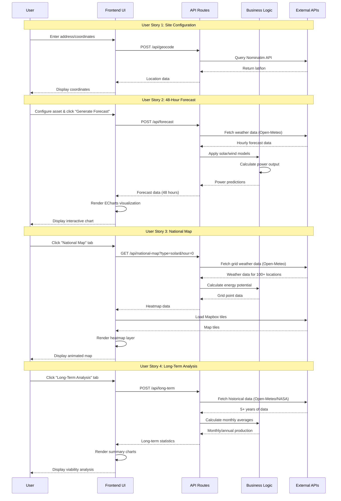

# GridCast Renewables - Architecture Documentation

## System Architecture Diagram

```mermaid
graph TB
    subgraph "Frontend Layer"
        UI[User Interface<br/>Next.js 16 + TypeScript]
        ACF[AssetConfigForm<br/>Location & Asset Input]
        PFC[PowerForecastChart<br/>ECharts Visualization]
        NEM[NationalEnergyMap<br/>Mapbox GL JS]
        LTA[LongTermAnalysis<br/>Historical Data View]
    end
    
    subgraph "API Layer - Next.js Routes"
        GEO[/api/geocode<br/>Address → Coordinates]
        FC[/api/forecast<br/>48-Hour Power Forecast]
        LT[/api/long-term<br/>Historical Analysis]
        NM[/api/national-map<br/>Grid Data Generation]
    end
    
    subgraph "Business Logic"
        WC[Weather Client<br/>API Integration]
        SM[Solar Model<br/>NREL PVWatts]
        WM[Wind Model<br/>Power Law + Curve]
    end
    
    subgraph "External APIs"
        NOM[Nominatim API<br/>OpenStreetMap Geocoding]
        OM[Open-Meteo API<br/>Weather Forecast & Historical]
        NASA[NASA POWER API<br/>Solar & Meteorological Data]
        MB[Mapbox API<br/>Map Tiles & Rendering]
    end
    
    UI --> ACF
    UI --> PFC
    UI --> NEM
    UI --> LTA
    
    ACF --> GEO
    ACF --> FC
    ACF --> LT
    NEM --> NM
    
    GEO --> WC
    FC --> WC
    LT --> WC
    NM --> WC
    
    WC --> SM
    WC --> WM
    
    GEO --> NOM
    WC --> OM
    WC --> NASA
    NEM --> MB
    
    style UI fill:#3b82f6,stroke:#1e40af,color:#fff
    style ACF fill:#60a5fa,stroke:#2563eb,color:#fff
    style PFC fill:#60a5fa,stroke:#2563eb,color:#fff
    style NEM fill:#60a5fa,stroke:#2563eb,color:#fff
    style LTA fill:#60a5fa,stroke:#2563eb,color:#fff
    
    style GEO fill:#10b981,stroke:#059669,color:#fff
    style FC fill:#10b981,stroke:#059669,color:#fff
    style LT fill:#10b981,stroke:#059669,color:#fff
    style NM fill:#10b981,stroke:#059669,color:#fff
    
    style WC fill:#f59e0b,stroke:#d97706,color:#fff
    style SM fill:#f59e0b,stroke:#d97706,color:#fff
    style WM fill:#f59e0b,stroke:#d97706,color:#fff
    
    style NOM fill:#8b5cf6,stroke:#7c3aed,color:#fff
    style OM fill:#8b5cf6,stroke:#7c3aed,color:#fff
    style NASA fill:#8b5cf6,stroke:#7c3aed,color:#fff
    style MB fill:#8b5cf6,stroke:#7c3aed,color:#fff
```

## Data Flow Diagram



## Architecture Components

### Frontend Layer (Blue)
- **User Interface**: Main Next.js application with TypeScript
- **AssetConfigForm**: Handles location input and asset configuration
- **PowerForecastChart**: ECharts-based visualization for 48-hour forecasts
- **NationalEnergyMap**: Mapbox GL JS implementation for spatial visualization
- **LongTermAnalysis**: Historical data analysis and viability assessment

### API Layer (Green)
- **`/api/geocode`**: Converts addresses to GPS coordinates
- **`/api/forecast`**: Generates 48-hour power forecasts
- **`/api/long-term`**: Provides historical analysis
- **`/api/national-map`**: Generates grid data for national visualization

### Business Logic (Orange)
- **Weather Client**: Centralized API integration layer
- **Solar Model**: Implements NREL PVWatts methodology
- **Wind Model**: Implements power law extrapolation and turbine power curves

### External APIs (Purple)
- **Nominatim API**: OpenStreetMap geocoding service
- **Open-Meteo API**: Weather forecasts and historical data
- **NASA POWER API**: Solar and meteorological data
- **Mapbox API**: Map rendering and tiles

## Technology Stack

| Layer | Technology | Purpose |
|-------|-----------|---------|
| Frontend Framework | Next.js 16.0 | React-based full-stack framework |
| Language | TypeScript 5.0 | Type-safe development |
| Styling | Tailwind CSS 4.0 | Utility-first CSS framework |
| Charting | ECharts | Interactive data visualization |
| Mapping | Mapbox GL JS | WebGL-powered map rendering |
| API Routes | Next.js Serverless | Backend API endpoints |
| HTTP Client | Axios | Promise-based HTTP requests |
| Deployment | Vercel | Serverless platform |

## Data Flow

1. **User Input** → Frontend collects location and asset configuration
2. **Geocoding** → Address converted to coordinates via Nominatim
3. **Weather Data** → Fetched from Open-Meteo or NASA POWER APIs
4. **Scientific Models** → Solar/wind calculations applied
5. **Visualization** → Results rendered via ECharts or Mapbox
6. **User Output** → Interactive charts and maps displayed

## Security & Performance

- **Environment Variables**: Sensitive API keys stored in `.env.local`
- **Rate Limiting**: Batch processing for National Map to prevent API throttling
- **Serverless**: Auto-scaling via Vercel's edge network
- **Caching**: Browser caching for static assets and map tiles

